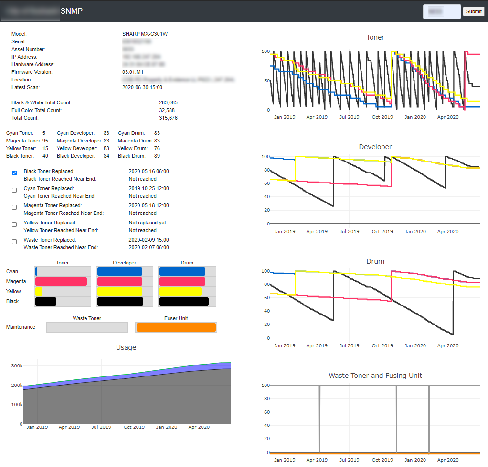

# SNMP Meter Interface

This project was created to make managing a fleet of MFPs and printers more easily, giving meter data and current toner level data in an easy-to-read interface.

## Data capture

The Powershell script should be run on a machine using Task Scheduler, given a reasonable executable interval.  A good rule of thumb is to use as short an interval as you can safely mitigate disaster.  An example would be 3hr intervals during workdays, such as 0600, 0900, 1200, 1500 and 1800.  Any more than that and you may get too many scans with no change in data.

The JavaScript portion is simply a "pretty" interface that displays all of the information per-machine in an easy-to-understand format.

## Informational text

- Model
- Serial Number
- Asset Number
- IP Address
- MAC Address
- Firmware Version
- Location (if set up in the machine)
- Latest Scan date (such as "2020/06/30 12:00")

The counts per type of prints are also given:
- Black and white
- Color
- Total (if also supplied by the machine, can be used to determine if something weird is going on)

## Toner level bars

While I prefer having color-coded bars, some people prefer straight text, so I have included both.  These display based on the type of machine, whether monochrome or color, separated by type (toner, developer, drum, maintenance items):

- Cyan
- Magenta
- Yellow
- Black
- Waste Bottle

## Graphs

Each historical datapoint, such as a meter-reading or toner level, is kept in order to be able to graph its change over time:

- Toner graph
- Developer graph
- Drum Graph
- Usage graph
